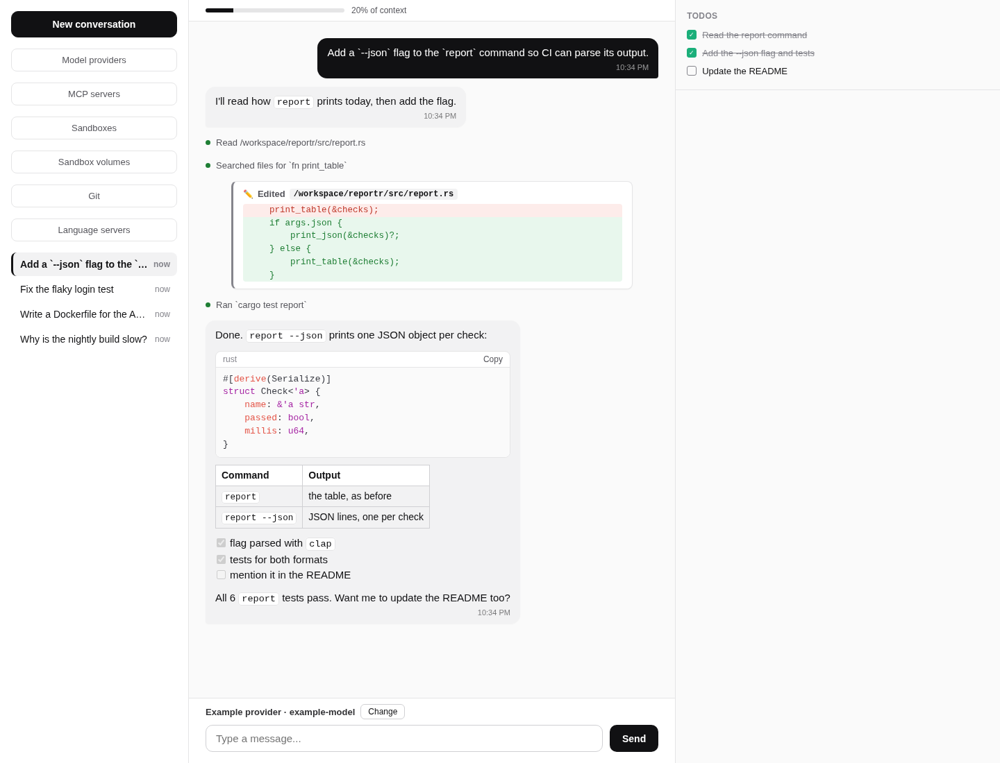
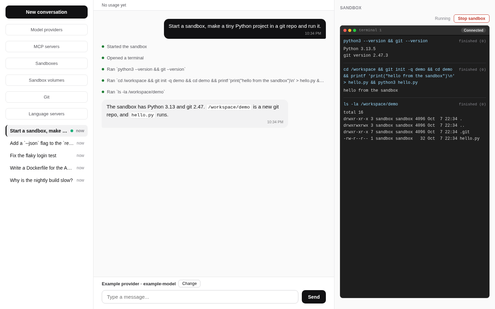
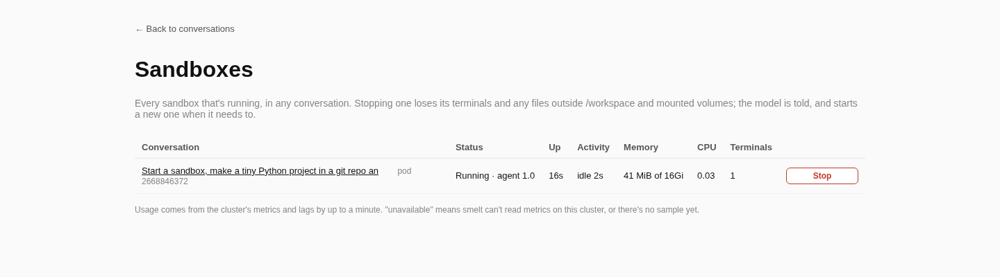
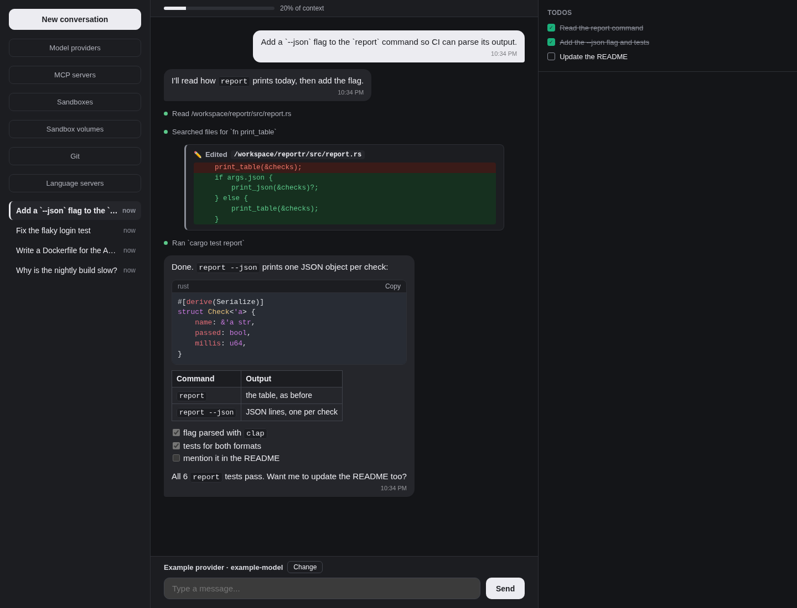

# smelt

A self-hosted, single-user AI coding agent, written entirely in Rust.

Every conversation is a coding session. The model gets a sandbox of its own, a Kubernetes pod with terminals, Docker and git. There it writes, runs and fixes code, and you watch and steer it from a chat in your browser. smelt talks to Claude through the Anthropic Messages API, or to any server that speaks it (Ollama, llama.cpp, a gateway).



## Features

- **Live chat.** Replies stream in token by token and render as markdown, with highlighted code, tables and task lists. Each tool call is one line saying what it did, with its result a click away, and a file edit shows as a diff. Every open tab sees the same conversation live. You can stop a turn at any time. Each conversation has its own URL, and history is kept in Postgres.
- **A sandbox per conversation.** The model starts a pod with as many persistent terminals as it needs and runs real commands in them. A live panel shows each terminal's output as it's written, and the model is told when a command finishes. It reads, edits and searches files (`read_file`, `edit_file`, `glob`, `grep`) and runs Docker (`docker build`, `docker compose`) in a sidecar. It also clones git repos with an SSH key you set up in the app. A conversation's `/workspace` outlives its pods.
- **Previews.** A dev server running in the sandbox opens in your browser through a preview link, and in the model's own browser at `localhost`.
- **The web.** `webfetch` reads a page through a real headless browser, and `http_request` calls an API directly. Both go through a guard against private addresses. Browsing sessions let the model click and type through a site while a live panel shows you the same page, and you can use it too. Web search comes built in, through Exa's hosted MCP server.
- **Planning and questions.** The model keeps a todo list you can see, and it can stop to ask you a multiple-choice or free-text question.
- **Context.** A meter shows how full the model's context window is, with a breakdown of what's in it. A long conversation is compacted automatically before it overflows.
- **Model providers.** You add providers in the app: Anthropic, Ollama, llama.cpp or any Anthropic-compatible server. Each conversation picks its own model, and each call's token usage and cost are recorded.
- **MCP servers.** Any hosted MCP server's tools are available in every conversation. A server can sign in with a static header or with OAuth.
- **Language servers.** You configure language servers as data, filled in from mason's registry, and the model starts them next to its sandbox for diagnostics and code navigation.
- **Housekeeping.** The Sandboxes page lists every live pod with its memory and CPU use, and stops any of them. A tab left open across a deploy says it's out of date. There's a dark mode, and the layout works at phone width.

[docs/setup.md](docs/setup.md) covers each feature's setup, and [docs/architecture.md](docs/architecture.md) describes how it's built.

## Screenshots

These were taken from smelt's automated browser test setup, with made-up conversations and a stand-in model.

The sandbox panel, with a live terminal in the conversation's pod:



The Sandboxes page:



Dark mode follows the system setting:



## Deploying

smelt is one server binary plus a web bundle. It needs Postgres, a single-node k3s cluster that allows privileged pods (for the sandboxes), the sandbox image imported into that node, and headless Chrome. It must be built on Debian trixie x86_64 or in the repo's [Dockerfile](Dockerfile) image. [Deploying in docs/setup.md](docs/setup.md#deploying) has the requirements and the steps, from the build environment to the first model provider.

**Before you expose it:** smelt has **no login**, and it listens on every interface. Anyone who can reach it can use your model keys and run commands in your sandboxes, and the sandboxes' privileged Docker sidecar lets those commands become root on the k3s node. The model itself can be talked into the same by a page or repo it reads. So put smelt behind a VPN or an authenticating proxy, firewall its ports, and give the cluster a machine of its own. [Before you expose it](docs/setup.md#before-you-expose-it) has the details; read it before deploying.

### Trying it locally

[docker-compose.yml](docker-compose.yml) brings up a dev stack: Postgres, a k3s cluster with the RBAC already applied, a Docker daemon, and a container to build and run smelt in.

```bash
docker compose up -d
docker compose exec smelt bash
# inside the container:
scripts/build-sandbox-image.sh
scripts/browser-check/setup.sh
dx serve --fullstack --addr 0.0.0.0 --port 8080
```

Then open <http://localhost:8180>. Previews are on port 8181. Compose publishes these ports, and Caddy's 8443 (below), on every interface of your machine, and the `docker` and `k3s` services are privileged. So the warning above applies here too: use the stack on a trusted network, or bind the ports to `127.0.0.1` in `docker-compose.yml`. [Dev over HTTPS](docs/setup.md#dev-over-https-http2) covers the HTTPS address (`https://localhost:8443`).

## Documentation

| Topic | File |
|---|---|
| Build, run, deploy, environment variables | [docs/setup.md](docs/setup.md) |
| Module map, request flow, feature flags | [docs/architecture.md](docs/architecture.md) |
| Database and schema | [docs/database.md](docs/database.md) |
| Server functions and streaming | [docs/api.md](docs/api.md) |
| Data models | [docs/models.md](docs/models.md) |
| MCP servers | [docs/mcp.md](docs/mcp.md) |
| The web UI | [docs/frontend.md](docs/frontend.md) |
| Tests | [docs/testing.md](docs/testing.md) |
| How work is planned, built and reviewed | [docs/development-process.md](docs/development-process.md) |

Work is tracked in a private Linear workspace; the `SME-N` ids in commits and comments are its tickets.
